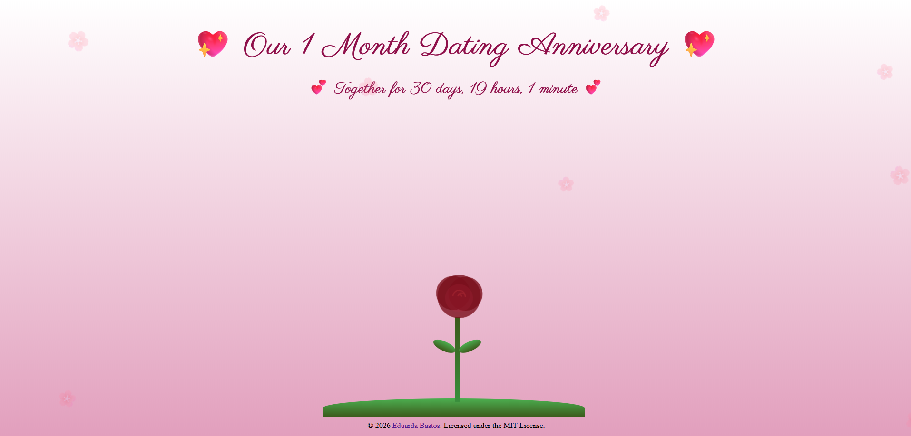

  
# Dating Anniversary

<i>A small interactive website to celebrate our dating anniversary, filled with hearts, flowers, and sweet surprises.</i>

<kbd>  </kbd>

 

 

## Table of Contents
- [Features](#features)
- [How to Use](#how-to-use)
- [Contributing](#contributing)
- [License](#license)

 

## Features

- **Dynamic Anniversary Counter**: Automatically calculates months and years together and updates in real-time.
- **Animated Hearts**: Colorful hearts float across the screen during the loading sequence.
- **Flower Surprise**: A beautiful flower appears after the loading, representing the growth of your relationship.
- **Interactive Messages**: Click the flower to reveal short, romantic messages that disappear after a few seconds.
- **Subtle Background Effects**: Gentle petals float in the background and the text has soft animations, adding a magical touch.
- **Responsive Design**: Works on both desktop and mobile screens.

 

## How to Use

1. **Open the Website**: Open `index.html` in your browser.
2. **Watch the Loading Animation**: Hearts will float across a background while a romantic message is displayed.
3. **Flower Surprise**: After the loading sequence, a flower appears in the center of the page.
4. **Click the Flower**: Click to see random heartfelt messages pop up for a few seconds.
5. **Celebrate Your Anniversary**: Enjoy the dynamic counter and the interactive animations together.

 

## Contributing
- Support this project by giving it a star ⭐. Thanks!
- Feel free to suggest improvements or report any issues in the repository.

## License
This project is licensed under the MIT License - see the [LICENSE](LICENSE) file for details.
